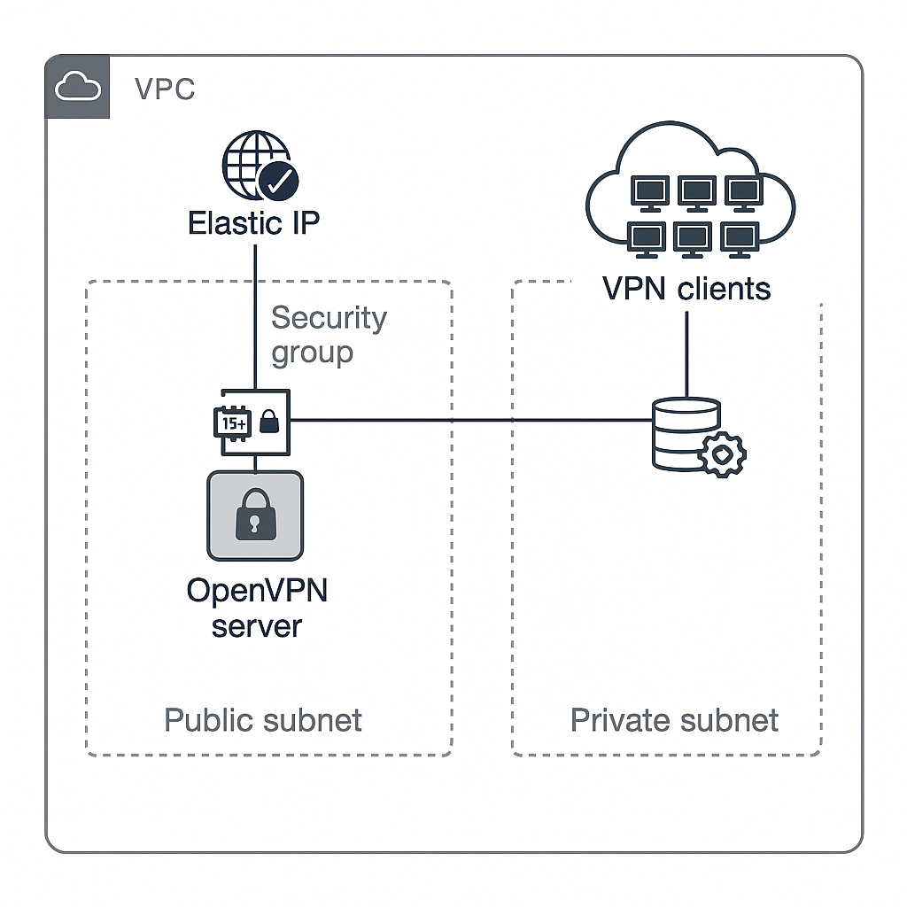

# AWS OpenVPN Server Auto-Deployment

Automated deployment of a secure OpenVPN server on AWS EC2 using CloudFormation and a setup script stored in S3.

## Features

- **One-Click Deployment**: Launch a production-ready VPN server in minutes
- **TLS 1.3 Support**: Modern encryption with AES-256-GCM and SHA384
- **Auto-Scaling Ready**: Designed for easy integration with AWS Auto Scaling
- **Multi-Client Support**: Generate up to 5 client configurations automatically
- **Cost Optimized**: Uses t3.micro instance (free tier eligible)
- **Secure Defaults**: 
  - Automatic Security Group configuration
  - IAM role with least privilege access
  - TLS-Auth protection against DDoS attacks


## 📐 Architecture



## 📁 Project Structure

```bash 
.
├── README.md # This file
├── deploy.sh # Shell script to deploy the stack
├── vpn-stack/
│ ├── openvpn_template.yaml # CloudFormation template
│ └── scripts/
│ └── vpn_config.sh # OpenVPN setup script
└── vpn_diagram.png # Network architecture diagram
```

## Prerequisites

- AWS Account with [CLI Access](https://docs.aws.amazon.com/cli/latest/userguide/install-cliv2.html)
- EC2 Key Pair ([Create one](https://docs.aws.amazon.com/AWSEC2/latest/UserGuide/ec2-key-pairs.html))
- An **S3 bucket** containing the `vpn_config.sh` script in the correct path
- The CloudFormation template (`vpn-stack/openvpn_template.yaml`)

## Deployment

### 1. Upload Configuration Script to S3
```bash
aws s3 cp vpn-stack/scripts/vpn_config.sh s3://your-bucket-name/vpn/scripts/vpn_config.sh
```


### 2. Launch CloudFormation Stack  
```bash
chmod +x deploy.sh
./deploy.sh
```

**Parameters**:  
| Parameter | Value Example |  
|-----------|---------------|  
| `KeyPairName` | your-ec2-key |  
| `S3BucketName` | your-bucket |  
| `ScriptKey` | scripts/vpn-config-auto.sh |  

### 3. Monitor Deployment (5-7 mins)  
```bash  
aws cloudformation describe-stack-events --stack-name VPN-Server  
```

## Post-Deployment 🔌

### 📥 Retrieve Client Configurations  
```bash  
scp -i your-key.pem ubuntu@SERVER_IP:/home/ubuntu/vpn-clients/client*.ovpn .  
```

## 🔗 Connect to VPN
```bash 
sudo openvpn --config client1.ovpn  
```

## ✅ Clean Up

```bash 
aws cloudformation delete-stack --stack-name vpn-stack

```